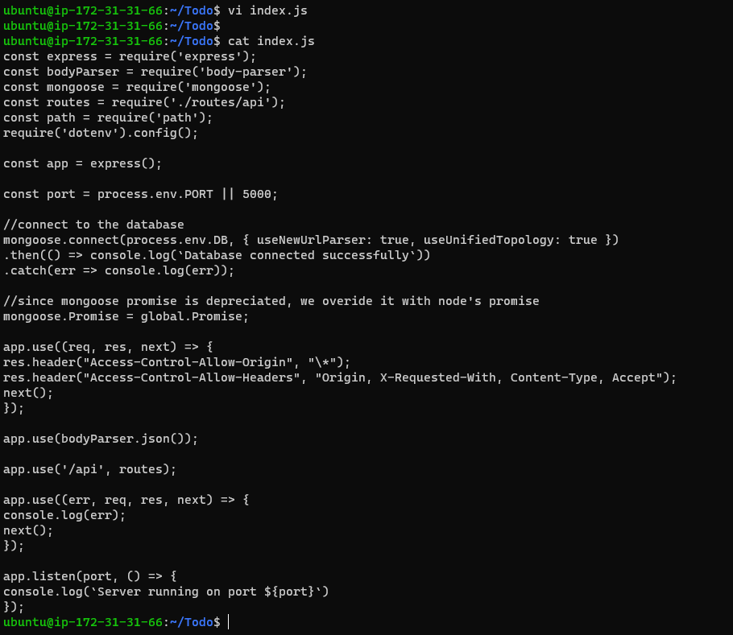
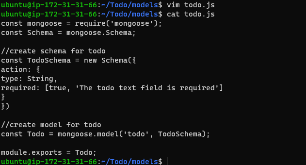

## Documentation of Project 3 MERN Stack; MongoDB, ExpressJS and ReactJS

`STAGE ONE BACKEND CONFIGURATION`

`Sudo apt update and upgrade`

`running curl command`

`Sudo apt get install`

`Nodejs and npm installed succesfully and confirm okay` 

`Create a new directory for your To-Do project`

`Project Initialise`

`Install ExpressJS`

`Create Index.js file`

`npm install dotenv`

`vim index.js`

`Starting the Server`

## Create a new task, Display list of all tasks and Delete a completed task

`mkdir routes, cd routes and touch api.js`

`npm install mongoose`

`mkdir models && cd models && touch todo.js`

`Routes update`

`MongoDB Database`

`Update index.js`

`Starting Server node index.js`

`Testing Backend Code without Frontend using RESTful API`

# QUESTION - backend testing connect successfully but return ërror input is empty for bot get and post. how can we correct that error please?

# SECOND STAGE - FRONT END CREATION 

`Run npx create-react-app client in Todo directory`

`Install concurrently - npm install concurrently --save-dev`

`Install nodemon - npm install nodemon --save-dev`

`Modify package.json file`

`Configure Proxy in package.json`

`Run command npm run dev`

`Creating your React Components - cd client, cd src, mkdir components, cd components and touch Input.js ListTodo.js Todo.js`

`Use Axios a a Promise based HTTP client for the browser and node.js`

`Create vi ListTodo.js`

`Create Todo.js`

`Create vi App.js`

`Create vi App.css`

`npm run dev`

##End of Project 3......